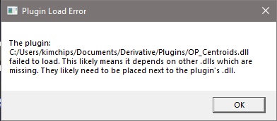
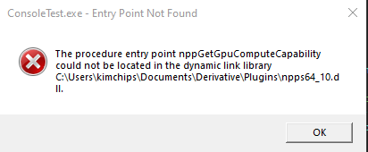

# Introduction

A library of motion capture operators for Touch Designer.

These operators triangulate bright features in corresponding camera images (e.g. retroreflective markers).

# Installation

You will need some extra files which aren't inside this repo. Specifically DLL's for OpenCV with CUDA and CUDA itself. These are available at: https://www.dropbox.com/sh/yjeef9fvf588hhf/AADe-vf76ImbWikNl6mRIAhwa?dl=0 .

These should be unzipped into your `thirdparty` folder.

In the future we may remove the requirement for CUDA if it becomes a problem. 

## Requirements

* CUDA 10.1 runtime : https://developer.nvidia.com/cuda-10.1-download-archive-base?target_os=Windows&target_arch=x86_64&target_version=10&target_type=exenetwork
* Ximea SDK : https://www.ximea.com/support/wiki/apis/XIMEA_Windows_Software_Package

# Troubleshooting

## DLL loads

If you get errors on load of TouchDesigner which look like:

Then try to run the ConsoleTest project to see a more descriptive error message e.g.:

Often these issues are related to mismatched CUDA versions, e.g. in this case CUDA 10.1 Release 2 is installed, when we need to install CUDA 10.1.